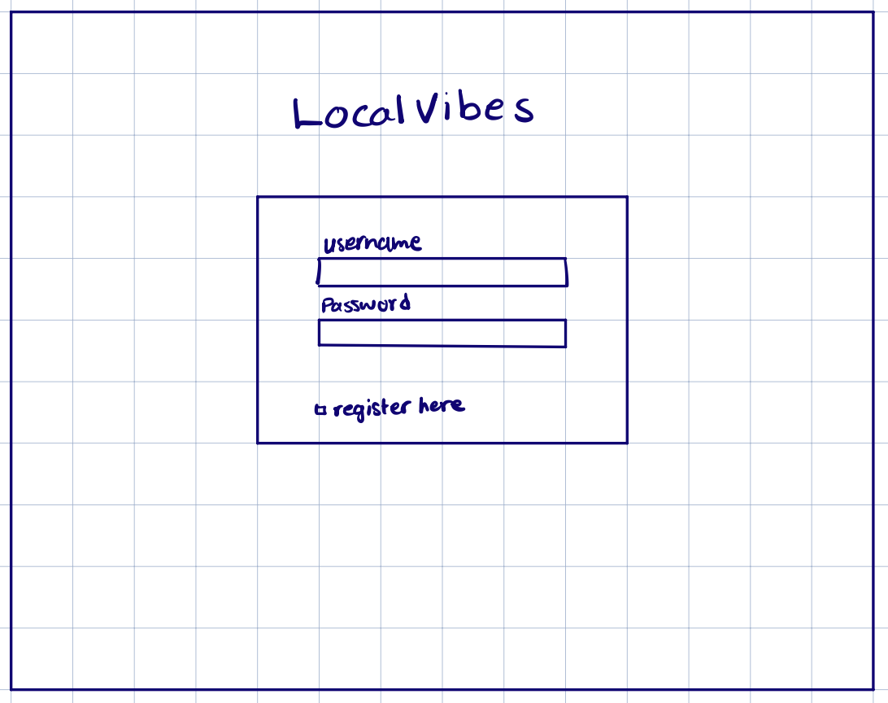
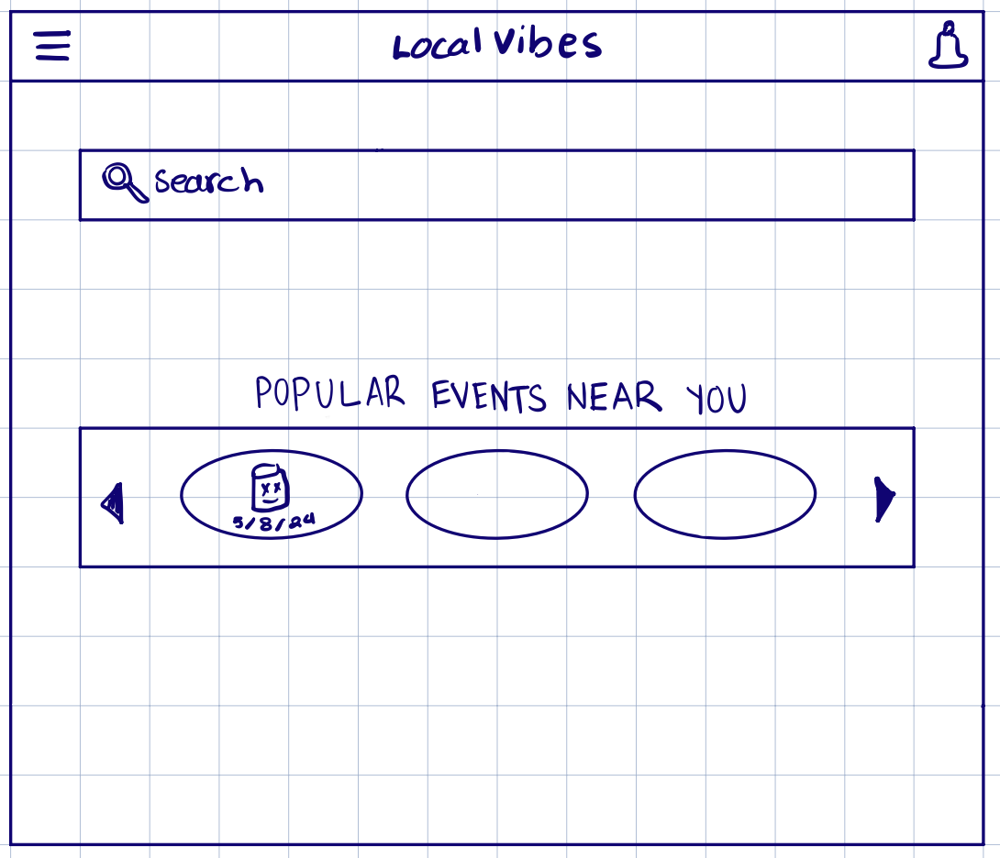
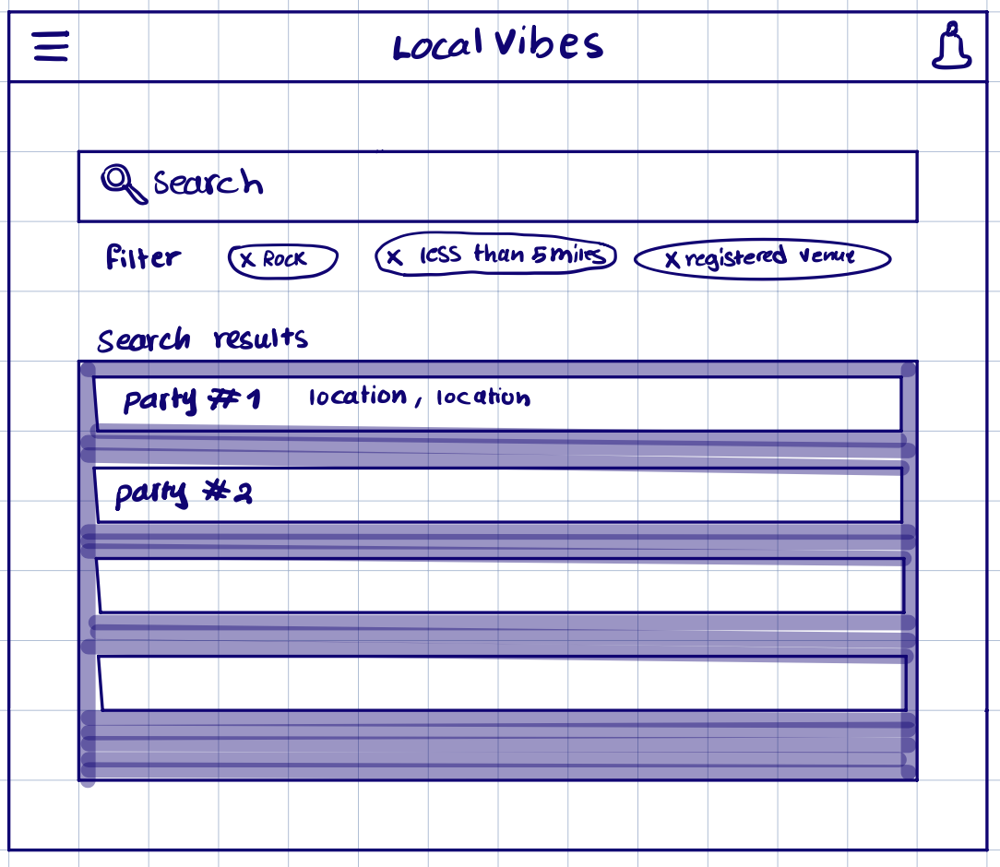
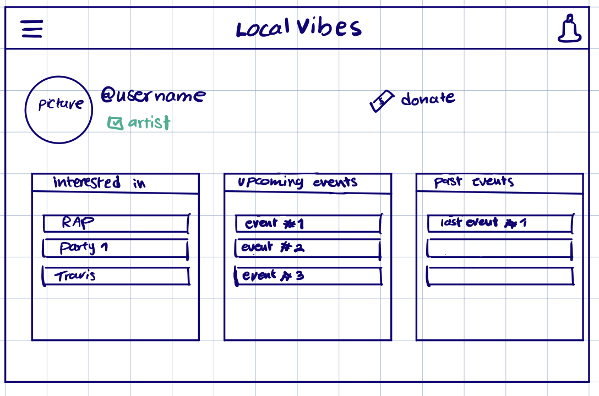
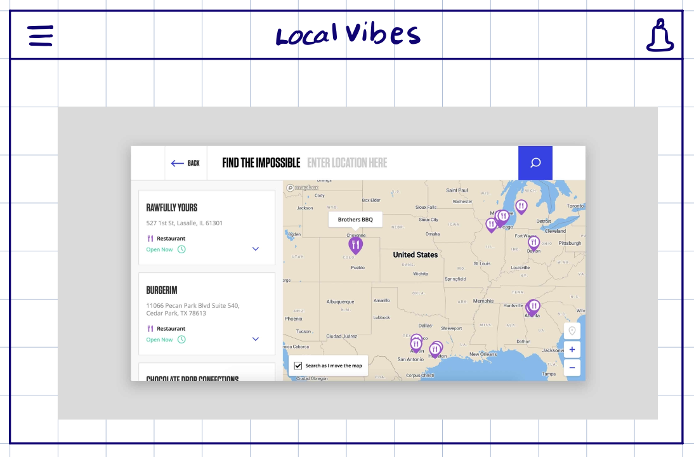
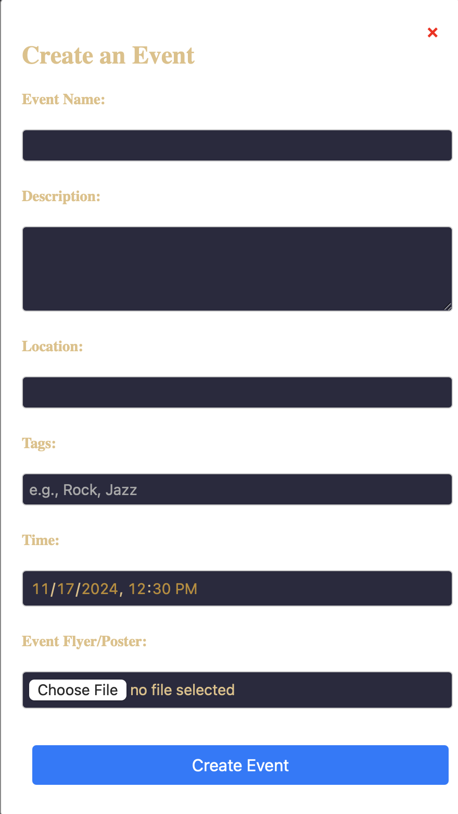

# UI Diagrams

## 1. Login Screen

The **Login Screen** is the first interaction users will have with LocalVibes. It offers a simple and clean layout to log in or register. The main elements on this screen include:

1. **Username Field**: A text input for the user’s username.
2. **Password Field**: A text input for the user’s password with hidden characters for privacy.
3. **Register Here Link**: A link to allow new users to register.

**Use Case**: 
A user trying to access LocalVibes will enter their username and password to log in. New users can click the 'Register Here' link to create a new account.

---

## 2. Home Screen

The **Home Screen** introduces users to LocalVibes by showing popular local events and offering a search function. Users can interact with:

1. **Search Bar**: Allows users to search for specific events, artists, or venues.
2. **Popular Events Section**: A carousel showcasing popular upcoming events near the user, with arrows to scroll through.
3. **Menu Icon**: Located at the top left, this opens a menu for navigation.
4. **Notifications Icon**: A bell icon in the top right, representing user notifications.

**Use Case**:
A user looking for upcoming events can quickly see a list of popular events near them. They can search by location or event type to find something specific.

---

## 3. Filtered Search Results

On the **Search Results Screen**, users see event listings based on their filtered search criteria. The main elements include:

1. **Search Bar**: Displays the user's active search query.
2. **Filters**: Users can see their applied filters, such as "Rock", "Less than 5 miles", or "Registered Venue."
3. **Event Listings**: Displays events matching the search, showing the event name and location. 

**Use Case**: 
After applying specific filters (e.g., music genre, distance), users will see a list of events meeting the criteria, helping them quickly find something of interest.

---

## 4. User Profile

The **User Profile Screen** allows users to view and manage their preferences, upcoming events, and past events. Main components include:

1. **Profile Picture & Username**: Displays the user’s profile image and username, with a badge indicating if they are an artist.
2. **Interested In**: Lists genres or events the user is interested in.
3. **Upcoming Events**: Displays events the user plans to attend.
4. **Past Events**: Displays a list of previously attended events.
5. **Donate Button**: Allows users to donate directly to local artists.

**Use Case**:
A user can review their preferences, check upcoming events, and look at the past events they've attended, helping them stay organized and up to date with their local music scene.

---

## 5. Interactive Event Map

The **Interactive Event Map** screen allows users to discover events by location. The screen includes:

1. **Map Interface**: Users can see various event locations on a map, with pins representing venues or house parties.
2. **Event Listings**: A list of events with details, including the venue name, type (e.g., restaurant), and status (open/closed).
3. **Search by Location**: Users can search events by entering a specific location, helping them find events in their area.

**Use Case**:
Users looking to discover events by location can explore the map to see what's nearby or in a specific area, making it easy to find local music events.

---

## 6. Event Sharing

The Event Creation Form allows event organizers to create and publish events by providing key details like the event name, description, location, time, and optional tags. Organizers can also upload a flyer or poster for the event.

Components:

1. Event Name Field: A text input for the event title (required).
2. Description Field: A text area for providing details about the event (required).
3. Location Field: A text input for the event's location (required).
4. Tags Field: A text input for specifying event categories or genres (e.g., "Jazz", "Open Mic
5. Time Picker: A date and time input for setting the event schedule (required).
6. Image Upload: A file input for uploading a flyer or poster (optional).
7. Submit Button: A button that validates the inputs and saves the event data to database.

Use Case:

A user (e.g., event organizer) fills in all required fields and optionally uploads a flyer or poster. Once the Submit Button is clicked:

1. Inputs are validated to ensure required fields are not empty.
2. The event details are saved to IndexedDB for persistence.
3. The form resets, ready for the next entry.

---

## Conclusion

Each screen in **LocalVibes** focuses on user experience by providing an easy-to-navigate interface. The wireframes showcase how users can explore local music events, manage their profiles, and contribute to the community by donating or reviewing shows.
